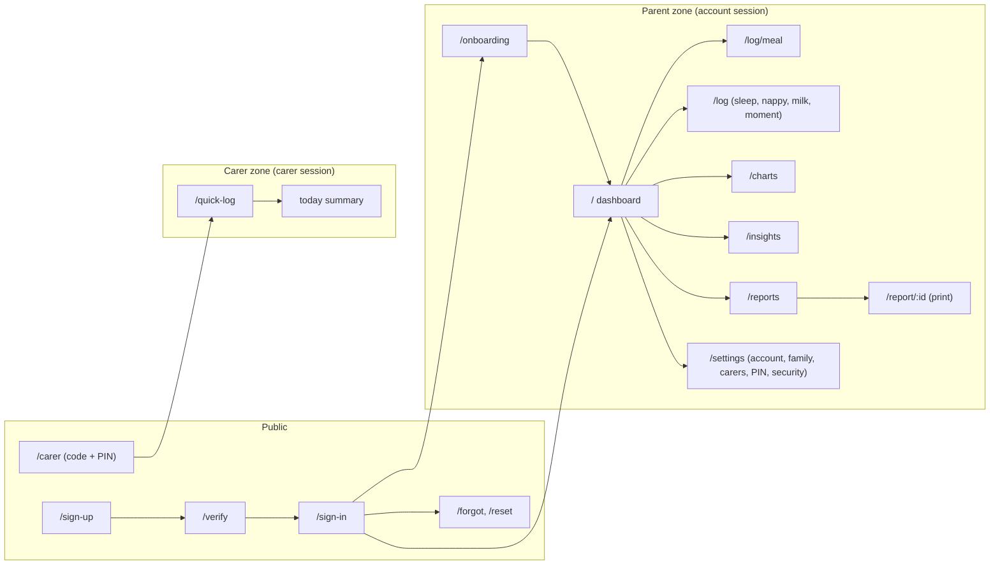
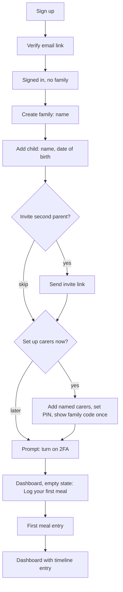
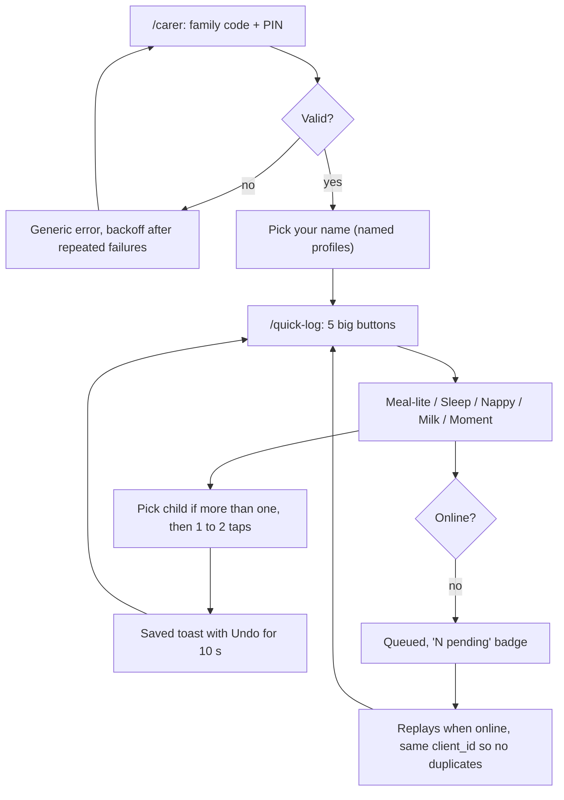
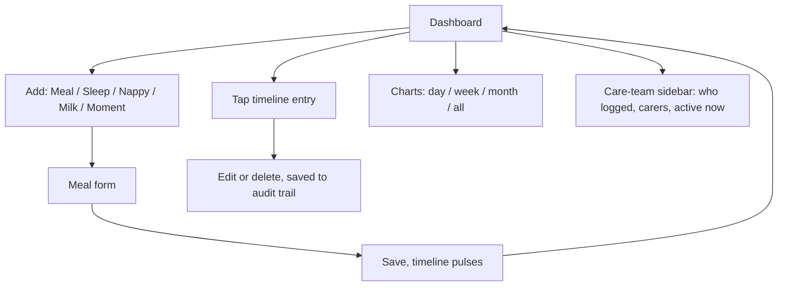
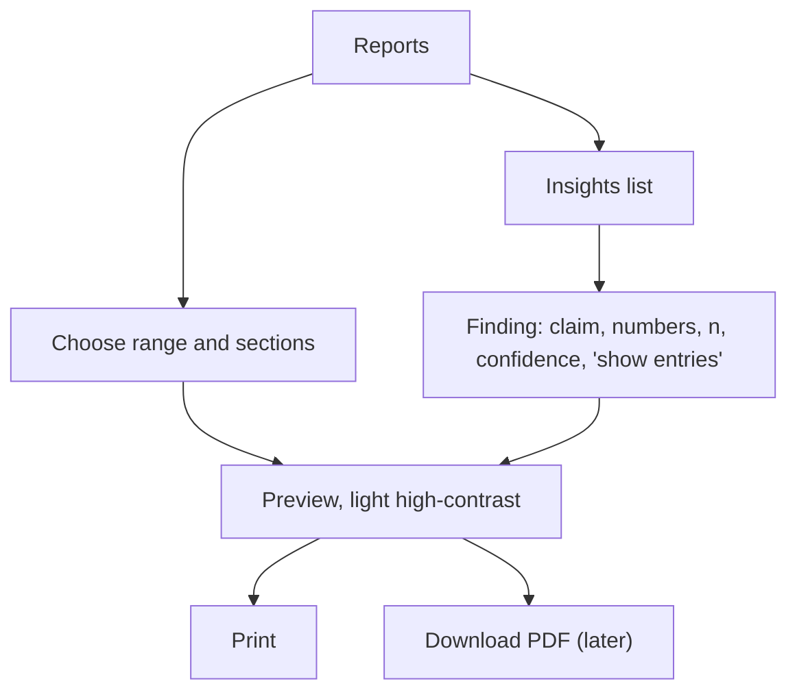

# User flows

What each person does in LittleProgress, screen by screen. Build the UI, API routes and tests from this, not the other way round.

Status: **planned, not built.** Related: [`plan.md`](plan.md) (roles, API list, UI brief, sync contract), [`auth.md`](auth.md) (server design: sign-in, reset, 2FA, families) and [`auth-client.md`](auth-client.md) (the client calls behind each screen).

## 1. Personas and goals

| Persona | Who | Gets | Constraints |
| --- | --- | --- | --- |
| **Parent** | Full account, 1 to 2 per family | Everything: log, edit, charts, insights, reports, settings | Often tired, often at night, one hand free. Phone and laptop |
| **Carer** | Nursery staff, grandparent. Shared family PIN, picks a named profile | Add-only logging and a small "today" summary | Shared or borrowed device, patchy wifi, no patience for menus |
| **Clinician** | Health visitor, dietitian, paediatrician | A printed or PDF report | Not a user. Never signs in |

Targets (from `plan.md` step 1): a meal logged in **under 30 seconds and 6 taps or fewer**; the carer screen has nothing on it except logging.

## 2. Screen map

Parent and carer are separate zones. There is deliberately **no edge from the carer zone to any parent route**: a carer token cannot reach them, and the UI does not link to them.

## 3. Flow A: parent, sign-up to first log

Sign-up, verification, sign-in, rate limits and 2FA mechanics are in [`auth.md`](auth.md) sections 4.1 to 4.8, and the exact client calls are in [`auth-client.md`](auth-client.md). A family is a Better Auth organization (`auth.md` 4.9). This flow starts where those leave off and adds the care-specific setup.

Resumable states (the app routes by the first one that is true, so closing the tab mid-way is safe):

| State          | Where the user lands                                   |
| -------------- | ------------------------------------------------------ |
| Not verified   | `/verify` with "resend link"                           |
| No family      | `/onboarding` step 1                                   |
| No child       | `/onboarding` step 2                                   |
| No entries yet | Dashboard empty state, one big "Log first meal" button |
| Has entries    | Dashboard                                              |

Rules:

- Only steps 1 and 2 (family, child) are required. Invite, carers and 2FA can be skipped and are reachable from settings; the dashboard shows a dismissible "finish setup" card until done.
- The family code and PIN are shown once at creation, with "copy" and "print card for the nursery". Later the PIN can only be rotated, never read.
- Second parent: gets an emailed invitation link (Better Auth organization invitation, 7 days), signs up or signs in, verifies their email, then accepts and joins the family as `admin`. The creator is the `owner`. Both are "parents" in this document.
- Date of birth is asked once and used for age in months (also what the AI sees, never the DOB).

## 4. Flow B: carer, PIN to quick-log

Design intent from `plan.md`: the PIN unlocks a **device**; the person then picks a parent-created named profile, so every entry says who logged it.

What the carer sees: the 5 buttons, a "today" list of the entries logged today (read-only), a "N pending" badge, a language switcher, a "not me" switch-profile link, and sign out. **Nothing else.** No charts, insights, reports, settings, edit or delete of other people's entries.

Edge cases:

| Case | Behaviour |
| --- | --- |
| Wrong PIN | Same error whether the family code or PIN was wrong. Per device+IP backoff, not a per-family lockout, so one bad actor cannot lock real carers out. Parents are notified |
| PIN rotated by a parent | Carer sessions are invalidated. Next action shows "Ask a parent for the new PIN". Queued entries are kept and sent after re-entry |
| Session expiry | 30-day sliding window per registered device. Expiry while offline never drops the queue |
| Lost or shared device | Parent revokes the device or rotates the PIN from settings |
| Undo | A carer can undo their own entry for 10 seconds; after that only a parent can edit or delete (open question, section 10) |
| Entry rejected by server (4xx) | Moves to a visible "could not save" list with the reason, never silently lost |

The meal-lite form is the full meal form cut down to: food, how it went (reaction), amount. Parents can fill the rest in later.

## 5. Flow C: parent, daily use and review

**Dashboard** is three columns on desktop (care team, meal-trial breakdown, timeline) and one stacked column on phone with a bottom bar. The timeline refreshes by polling, and a new entry from someone else pulses.

**Meal form** (target 6 taps or fewer):

1. Food: autocomplete from the family's foods; typing a new one creates it. The attempt number is computed from history and shown ("attempt 4 of broccoli").
2. Chip rows, large tap targets: texture, temperature, reaction, amount, setting, distractions. Defaults are the last used values; time defaults to now and is editable.
3. Optional note and photo.
4. One Save. Everything else is pre-filled, so the minimum is food + reaction + Save.

**Other entry types**:

- Sleep: "Start sleep" begins a running timer shown on the dashboard; "Wake" ends it. Manual start and end are also allowed. Overlapping sleeps are refused with a clear message.
- Nappy: wet, dirty, both, one tap.
- Milk: ml or duration, plus type.
- Moment: category (movement, sound, word, first try) and text.

**Edit and delete** (parents only): every change writes the before and after to the audit trail. Delete is a soft delete with a short "Undo". Editing uses a version check; if someone else changed it first, the user sees the newer copy and re-applies their edit (HTTP 412 in `plan.md`).

**Charts**: intake by texture, acceptance by temperature and time of day, sleep bars, nappy counts, milestone timeline. Range selector day/week/month/all. Each chart states its sample size and has a "show the entries behind this" link.

## 6. Flow D: reports and insights

- **Report** sections: child summary, eating history table, reaction/texture/temperature breakdowns, sleep and nappy summary, milestones, identified patterns with n. The clinician copy can be forced to English.
- **Insights** are deterministic statistics first; AI narration is optional and last (see `plan.md`, "Insights validity"). Every finding shows its evidence and sample size, and the page always carries a fixed "not medical advice, discuss with your health visitor" line.
- **Empty state**: with too little data (under the minimum sample per cell) the page says what is needed ("log 10 more meals to compare temperatures") instead of showing weak findings.
- Printing and PDFs never include carer PIN, family code or other family members' emails.

## 7. Cross-cutting states

Every screen defines these, so none is improvised during build:

| State | Behaviour |
| --- | --- |
| Loading | Skeleton of the final layout, no spinner-only pages |
| Empty | One sentence on why it is empty and one button to fix it |
| Error | Plain words, what happened, a retry button. Never a raw error or stack |
| Offline | Banner plus "N pending"; logging keeps working; read screens show the last cached data marked as old |
| Session expired | Return to sign-in (parent) or PIN (carer) and come back to the same place |
| Rate limited (429) | Shows when to try again using `Retry-After` |
| Locked out | Password: the 429 countdown (`auth.md` 4.6). 2FA: "too many wrong codes, try again later" (`ACCOUNT_TEMPORARILY_LOCKED`). Sign-in errors stay generic |

Rules for all screens: dark theme first, all text from message catalogs (no hard-coded strings, so i18n stays possible), 24-hour tabular times, tap targets at least 48 px, keyboard and screen-reader usable.

## 8. Flow to build map

Routes are from `plan.md`'s API list. "New" means the route is implied here but not yet listed there.

| Flow step | API | Milestone | Proof (test) |
| --- | --- | --- | --- |
| Sign up, verify, sign in | `/api/auth/*` (Better Auth) | M1 | `auth.md` section 12 |
| Create family and child | `organization.create` (Better Auth), `POST /children` (new, ours) | M1 | Parent can only see own family; one family per parent |
| Invite second parent | `organization.inviteMember`, `acceptInvitation` (Better Auth) | M1 | Invitation expires in 7 days, needs a verified email |
| Add carers, set and rotate PIN | `POST /settings/carer-pin`, carer CRUD | M3 | Rotation invalidates carer sessions |
| Carer PIN login | `POST /carer/login` | M3 | Wrong PIN backoff; carer cannot call parent routes (table test) |
| Log an entry (any role) | `POST /entries` | M2 | Replay N times gives 1 row; `logged_by` comes from the token |
| Edit, delete | `PATCH`, `DELETE /entries/:id` | M2 | Writes audit row; stale `If-Match` gives 412; carer gets 403 |
| Dashboard and timeline | `GET /timeline`, `GET /entries` | M4 | Seed data renders; polling shows new entry |
| Charts | `GET /stats/*` | M5 | Totals match the entries list |
| Report | `POST /reports`, `GET /reports/:id` | M6 | Print view matches dashboard numbers |
| Insights | `POST /insights/run`, `GET /insights` | M7 to M8 | Every number in a finding appears in the stats |

## 9. What this doc does not cover

Visual design (tokens and layout are in `plan.md` "UI") and wireframes. Wireframes in a `.pen` file are a sensible next step once these flows are agreed.

## 10. Open questions

- Can a carer undo their own entry after the 10-second window, or is it parent-only from then on?
- Does the carer "today" list show other people's entries (more useful for nursery handover) or only their own (more private)? Lean: show all of today, read-only.
- Second-parent invite: link only, or link plus a code read aloud?
- Where does the 2FA prompt sit: end of onboarding (here), or required before the first report export or PIN change (`auth.md` recommendation)? They can be combined.
- One child at launch with the child switcher added later, or the switcher from day one? Lean: data model supports many, UI shows a switcher only when there is more than one.
- Is "Meal-lite" the right carer meal form, or should carers get the full form behind a "more" link?
